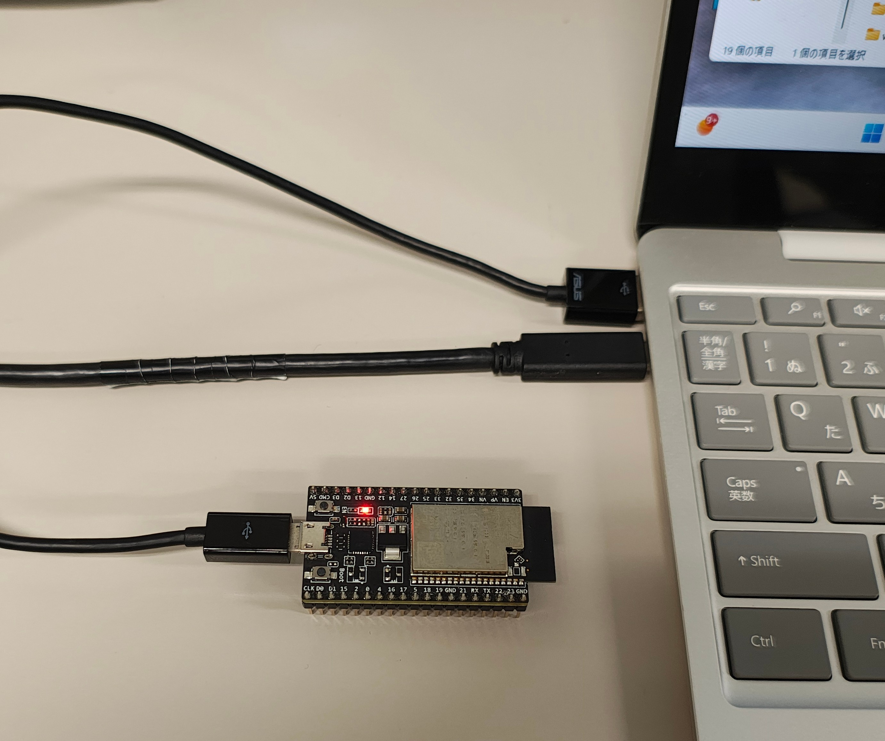
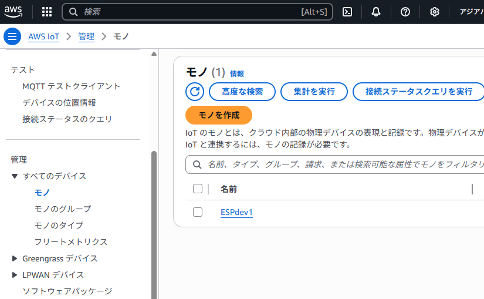
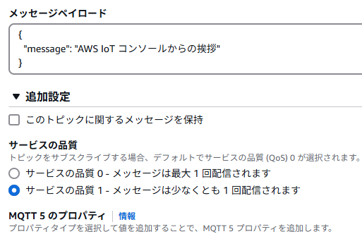
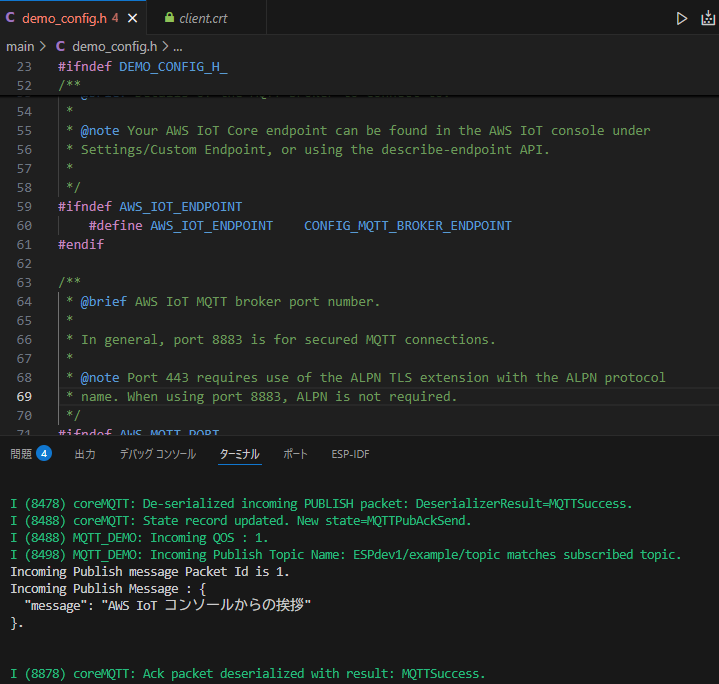

# ESP32 - AWS IoT (TLS 相互認証) — ポートフォリオ

> 自分が実際に試した手順を記録したポートフォリオ用 READMEです。

（オリジナルの `README.md` はREADME_originalとして残しています）。

---

##  概要
- ボード: **ESP32-DevKitC (Espressif Systems)**
- ソフトウェア: **ESP-IDF (v5.4.1)** と **Amazon FreeRTOS / AWS IoT** のデモ
- 目的: TLS の相互認証（クライアント証明書 + ルートCA）で ESP32 と AWS IoT を安全に通信させる

---

##  使用した手順
1. 開発環境の準備 
   - ESP-IDF をインストール(https://dl.espressif.com/dl/esp-idf/)
 
   今回の環境では **v5.4.1** を使用。
   - ESP32 が PCのシリアルポート接続されているかを確認

   

2. FreeRTOSデバイスソフトウェアのインストール
   - 以下のレポジトリを参照してクローン／ダウンロード
   （参考: https://github.com/espressif/esp-aws-iot ）

3. AWS IoT 側で Thing を登録
   - AWS コンソールで Thing を作成し、デバイス証明書プライベートキールートCA を取得。

    

   - 取得したファイルはローカルに保存（※公開リポジトリには絶対にアップしない）。

4. 証明書の配置
   - 証明書類をこのプロジェクトの `main/certs/` に配置（ファイル名は例示）：
     - `device_cert.pem`（デバイス証明書）
     - `private_key.pem`（プライベートキー）
     - `root_cert_auth.pem`（ルート CA）
   - 実ファイルは `.gitignore` で除外すること（例を下に記載）。

5. Example Configuration の設定
   - `idf.py menuconfig` を実行し、`Example Configuration` で以下を設定：
     - **MQTT Broker Endpoint**（AWS IoT のカスタムエンドポイント）
     - **MQTT Client ID**（このデバイス用に一意に設定）

6. ビルド・フラッシュ
   - ビルド: `idf.py build`
   - フラッシュ: `idf.py -p <PORT> flash`
   - ログ確認: `idf.py -p <PORT> monitor`

7. 相互通信の確認
   - AWS 側から MQTT トピックへメッセージを送信し、ESP32 のシリアル出力で受信を確認。

   <AWS側送信画面>
   

   <ESP側受信確認>
    

   - ESP32 から AWS へ `Hello World` 等を Publish して、AWS 側で受信確認。

---

##  セキュリティ上の注意
- **プライベートキーやデバイス証明書は絶対に公開リポジトリに含めないでください。**
- `.gitignore` に以下のようなルールを追加してください（例）：

```
# certs
main/certs/*.pem
main/certs/*.key
```

- スクリーンショットやログにシークレット情報（ARN、アカウントID、フルMQTTトピック名など）が含まれていないか確認が必要です。

---


---

## リファレンス 
- 元の example: https://github.com/espressif/esp-aws-iot
- AWS IoT ドキュメントを参照して設定証明書の扱いを確認しました。

---

### 
この README は自分が再現できるようにまとめたポートフォリオ用ドキュメントです。元リポジトリへの帰属を明示し、機密情報は含めないようにしています。
